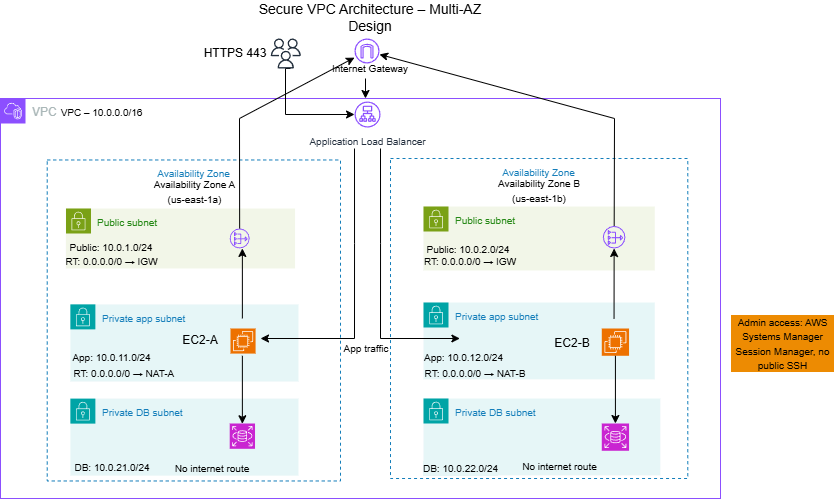

# Secure VPC Architecture

## Overview
This project presents a secure, multi-AZ VPC architecture designed for high availability, network segmentation, and controlled administrative access. The design separates public, private application, and private database resources across two Availability Zones to improve resilience and reduce attack surface.

## Architecture Diagram

## Design Summary
The architecture uses:
- One VPC spanning two Availability Zones
- Public subnets for internet-facing components
- Private application subnets for compute resources
- Private database subnets with no direct internet route
- NAT Gateways in each Availability Zone for resilient outbound access
- AWS Systems Manager Session Manager instead of a bastion host for administrative access

## Design Decisions
### 1. Multi-AZ deployment
Resources are distributed across two Availability Zones to reduce the impact of a single AZ failure and improve availability.

### 2. Public, private, and database subnet separation
The architecture isolates internet-facing resources from application and database resources. This reduces exposure and supports least-privilege network design.

### 3. NAT Gateway in each Availability Zone
Each private application subnet uses a NAT Gateway in the same Availability Zone. This avoids dependence on a single NAT Gateway and reduces cross-AZ dependency during failure scenarios.

### 4. No bastion host
Instead of exposing SSH access through a bastion host, the design uses AWS Systems Manager Session Manager. This reduces attack surface, avoids managing inbound SSH rules, and improves administrative security.

### 5. Private database subnets with no internet route
Database resources are placed in private subnets with no direct internet access. This helps protect sensitive data and aligns with secure application architecture patterns.

## Security Considerations
- Application and database resources are separated into private subnets
- Database subnets have no route to the internet gateway
- Administrative access is handled through Systems Manager Session Manager instead of SSH bastion access
- Security groups should allow only required traffic between tiers, such as application-to-database communication
- Public exposure should be limited to only required internet-facing components

## Cost Considerations
- Using a NAT Gateway in each Availability Zone increases cost compared to a single NAT Gateway design
- The additional NAT Gateway cost is justified by improved resilience and reduced dependence on cross-AZ traffic
- Systems Manager Session Manager reduces the need to run and maintain a bastion host, which can lower operational overhead
- Multi-AZ design increases infrastructure cost but improves uptime and fault tolerance

## Tradeoff Analysis
### Benefits
- Improved availability through multi-AZ deployment
- Stronger security through subnet isolation and no bastion host
- Better operational access model using Systems Manager
- Reduced risk of full service interruption during a single AZ outage

### Tradeoffs
- Higher cost due to one NAT Gateway per Availability Zone
- More complexity than a simple single-AZ architecture
- Session Manager requires proper IAM role configuration and setup
- Multi-tier subnet design may be more difficult for beginners to configure and troubleshoot

## Failure Scenario: AZ-A Outage
If Availability Zone A fails:
- Resources in AZ B remain operational
- Traffic can continue to healthy resources in AZ B
- Private subnets in AZ B retain outbound access through NAT-B
- Database availability can continue if deployed with a Multi-AZ database configuration

## Failure Scenario Notes
- Existing sessions connected to resources in AZ A may be interrupted
- Recovery depends on workload design, including stateless application behavior and proper load balancing
- Failover can increase load on remaining resources in AZ B
- Operating in degraded mode may temporarily reduce capacity until recovery is complete

## Improvements for Future Iterations
Future enhancements could include:
- Explicit load balancer placement and traffic flow labeling
- Security group relationship diagram
- Route table detail section
- Network ACL discussion
- VPC endpoints for private AWS service access
- More detailed database failover notes

## Key Takeaways
This architecture demonstrates how AWS networking can be designed for security, resilience, and maintainability. The design prioritizes controlled access, private resource placement, and reduced single points of failure, while accepting higher cost and complexity as tradeoffs for stronger availability and security.
